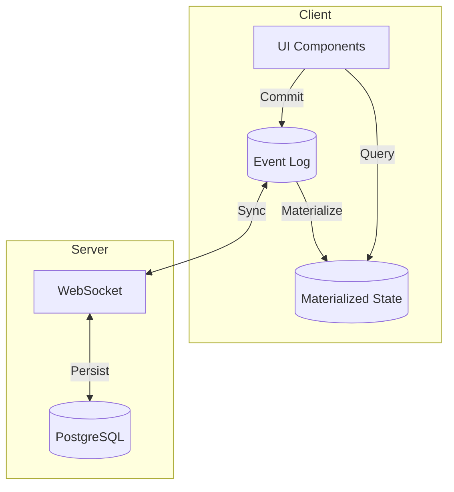

# Flowline

[](https://github.com/RATIU5/flowline)
[](https://www.typescriptlang.org/)
[](https://effect.website/)
[](LICENSE)

Real-time collaborative task management and chat. Tasks emerge from conversations. Built with **operation-based sync** and **Effect-ts**.

> [!NOTE]
> Personal learning project for Effect-ts and distributed systems. Early development.

---

## Architecture



**Principles**: Vertical slices · Effect-first · Offline-first · Operation-based sync · Per-field LWW with Hybrid Logical Clocks

---

## Roadmap

> [!IMPORTANT]
> **Current Phase**: Project 1 — Basic Real-Time Chat

|  #  | Project               | Status | Focus                                           |
| :-: | --------------------- | :----: | ----------------------------------------------- |
|  1  | Real-time chat        |   🚧   | Effect WebSocket services, message broadcasting |
|  2  | Persistence           |   ⏳   | Postgres integration, message history           |
|  3  | Hybrid Logical Clocks |   ⏳   | Causal ordering, out-of-order handling          |
|  4  | Offline support       |   ⏳   | IndexedDB operation log, sync on reconnect      |
|  5  | Conflict resolution   |   ⏳   | Per-field LWW for tasks, multi-user editing     |

---

## Learning Goals

- **Effect-ts** — Service layers, WebSocket handling, Streams, error channels
- **Distributed Systems** — Operation-based sync, HLCs, causal ordering, eventual consistency
- **Conflict Resolution** — Per-field LWW, operation-based CRDTs, offline-first architecture
- **Real-Time Systems** — WebSocket pub/sub, optimistic UI, state reconciliation

---

## Tech Stack

<details>
<summary>View full stack</summary>

**Core**: Effect-ts · TypeScript · Bun

**Frontend**: SvelteKit · Tailwind CSS · IndexedDB

**Backend**: Elysia · Effect Platform · Better Auth · PostgreSQL

**Infrastructure**: Fly.io · Neon · Bunny CDN

**Dev**: Biome · Vitest · OpenTelemetry

</details>

---

## Quick Start

```bash
git clone https://github.com/RATIU5/flowline.git
cd flowline
bun install
bun dev
```

> [!TIP]
> Run `bun dev:be` or `bun dev:fe` for backend/frontend only.

---

## Project Structure

```
flowline/
├── packages/
│   ├── @flowline/          # Core libraries used throughout
│   ├── flowline/           # Elysia + Effect backend
├── app/                    # SvelteKit frontend
└── docs/                   # Architecture decisions
```

---

## Contributing

> [!CAUTION]
> Architecture may change significantly. Feedback welcome via [issues](https://github.com/RATIU5/flowline/issues).

---

## License

[MIT](LICENSE)
